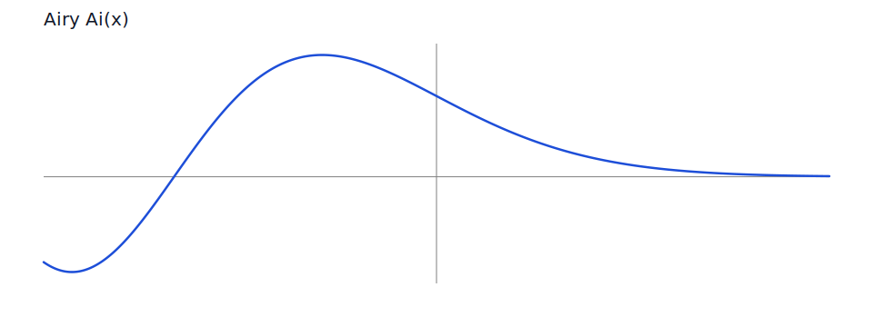
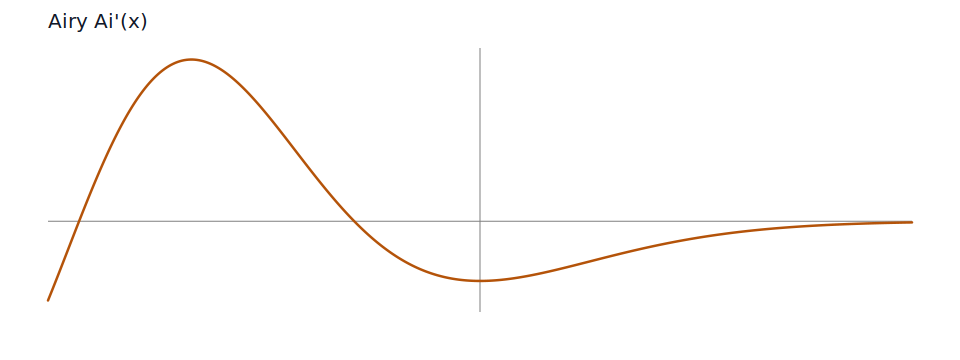
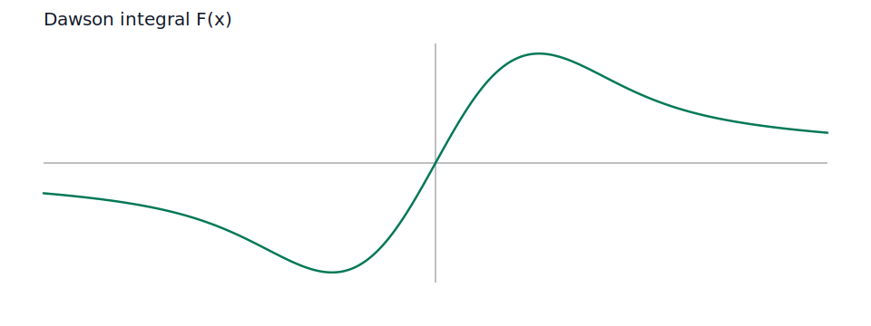

# Mathematical Background

This page gives the family-level formulas and implementation notes behind the public API. The detailed function-by-function reference is in [Functions](functions.md).

## Faddeeva family

The Faddeeva routines implement the complex error family and its common real projections.

```math
w(z) = e^{-z^2}\,\operatorname{erfc}(-iz)
```

From that identity, the other exported helpers follow:

```math
\operatorname{erfcx}(z) = e^{z^2}\operatorname{erfc}(z),
\qquad
\operatorname{erf}(z) = 1 - \operatorname{erfc}(z),
\qquad
\operatorname{erfi}(z) = -i\,\operatorname{erf}(iz).
```

The real Dawson integral used by the Faddeeva wrappers is

```math
F(x) = e^{-x^2}\int_0^x e^{t^2}\,dt = \frac{\sqrt{\pi}}{2} e^{-x^2} \operatorname{erfi}(x).
```

The complex-valued routines are mapped back to [Faddeeva/Faddeeva.c](https://github.com/qchen-fdii-cardc/openspecfun/blob/main/Faddeeva/Faddeeva.c) through the provenance table in the module.

## Machine helpers

`d1mach`, `i1mach`, and `dgamln` are compatibility helpers from AMOS.

- `d1mach` and `i1mach` report the machine constants the AMOS algorithms use when they decide whether a branch is safe.
- `dgamln` computes $\log\Gamma(z)$ for positive real input using the same kind of recursion-plus-asymptotics structure AMOS uses in the original package.
- `xerror` is a compatibility stub that preserves the original error-reporting entry point.

These routines are not mathematical end points on their own, but they control branch selection, scaling thresholds, and error handling throughout the AMOS port.

## Split-complex helpers

The routines `zabs`, `zdiv`, `zexp`, `zlog`, `zmlt`, `zsqrt`, and `zshch` are split-real/imaginary compatibility helpers. They mirror the Fortran ABI used by AMOS and allow the translated routines to keep the same calling style while still running in Julia.

In practice they provide the arithmetic primitives needed by the rest of the AMOS family:

- `zabs` for a stable complex magnitude.
- `zdiv`, `zmlt`, and `zexp` for basic complex arithmetic.
- `zlog` and `zsqrt` for principal-branch logarithm and square root with Fortran-style quadrant handling.
- `zshch` for the hyperbolic sine/cosine pair used in the recurrence and continuation routines.

## Bessel and Airy family

AMOS computes the Bessel and Airy routines through a mix of power series, recurrence, asymptotic expansions, and analytic continuation.

The Airy functions are tied to order-$1/3$ and order-$2/3$ modified Bessel functions:

```math
Ai(z) = \frac{1}{\pi\sqrt{3}}\sqrt{z}\,K_{1/3}\left(\frac{2}{3}z^{3/2}\right),
\qquad
Ai'(z) = -\frac{1}{\pi\sqrt{3}} z\,K_{2/3}\left(\frac{2}{3}z^{3/2}\right).
```

The translated implementation keeps the original split between the small-$|z|$ power series and the large-$|z|$ Bessel path described in the prologue of [amos/zairy.f](https://github.com/qchen-fdii-cardc/openspecfun/blob/main/amos/zairy.f).

For the Bessel sequence functions, the classical family identities are the ones the AMOS code organizes around:

```math
I_\nu(z) = i^{-\nu} J_\nu(iz),
\qquad
Y_\nu(z) = \frac{J_\nu(z)\cos(\pi\nu) - J_{-\nu}(z)}{\sin(\pi\nu)},
```

```math
H_\nu^{(1)}(z) = J_\nu(z) + iY_\nu(z),
\qquad
H_\nu^{(2)}(z) = J_\nu(z) - iY_\nu(z).
```

`zbesi`, `zbesj`, `zbesk`, `zbesy`, and `zbesh` are sequence routines: they compute values for $\nu, \nu+1, \nu+2, \ldots$ and optionally apply the AMOS scaling conventions.

## Continuation and asymptotic workers

Several public entries are worker routines that preserve the original AMOS control flow.

`zacai` is the continuation helper that moves the `K`-Bessel branch between half-planes using

```math
K(\nu, z e^{m\pi i}) = K(\nu, z)e^{-m\pi i\nu} - m\pi i\,I(\nu, z).
```

The related `zacon` wrapper preserves the same continuation idea for the broader AMOS call surface.

`zbinu`, `zbknu`, `zmlri`, `zseri`, `zasyi`, `zrati`, `zuni1`, `zuni2`, `zbuni`, `zunk1`, `zunk2`, `zbunk`, and `zuoik` correspond to the original recurrence, series, asymptotic, and uniform-expansion entry points. In the original package, these names are not decorative: they mark the exact branch families used to choose the numerically safest approximation for a particular region of the complex plane.

## Uniform asymptotic parameter routines

`zunik` and `zunhj` compute the asymptotic parameters that drive the large-order Bessel approximations. These are the routines that build the phase, amplitude, and correction series used by the `I`, `J`, `Y`, and Hankel families when order and argument are both large.

The implementation keeps the original idea from AMOS: determine the asymptotic parameters first, then reuse them in the actual sequence routines rather than recomputing the expansion logic in each public function.

## Safety and scaling helpers

`zuchk`, `zkscl`, and `zs1s2` are the safety valves that keep the AMOS recurrences numerically usable.

- `zuchk` checks whether a complex term would underflow relative to the current scaling threshold.
- `zkscl` rescales a `K`-sequence when the magnitude moves toward the underflow limit.
- `zs1s2` combines the two-term continuation contributions and applies the safety scaling used by the original continuation logic.

These helpers are part of why the translated package can keep the original branch structure instead of collapsing everything into a single generic approximation.

## Reference charts

The charts in this section are generated by `docs/scripts/plot_reference_charts.jl`.

### Airy `Ai(x)`



### Airy `Ai'(x)`



### Dawson integral



## References

- Donald E. Amos, *A portable package for Bessel functions of a complex argument and nonnegative order*.
- Donald E. Amos, *Computation of Bessel functions of complex argument and large order*.
- M. Abramowitz and I. A. Stegun, *Handbook of Mathematical Functions*.