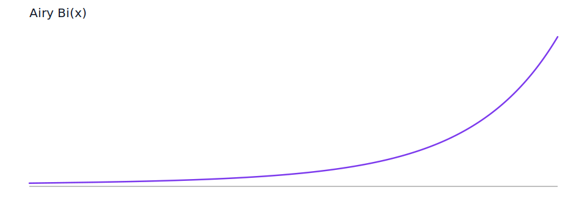
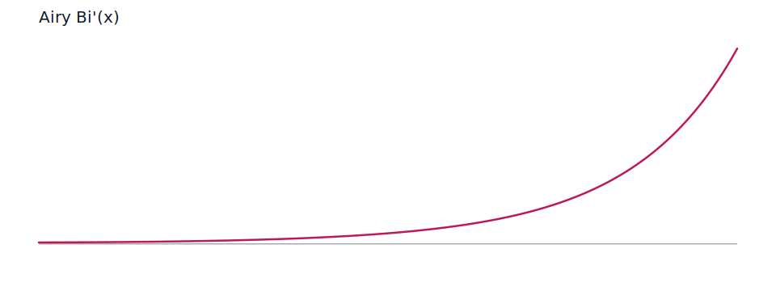
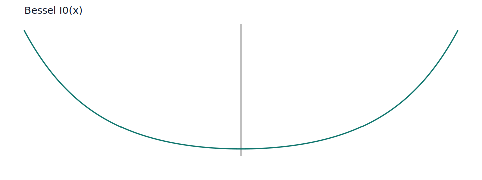
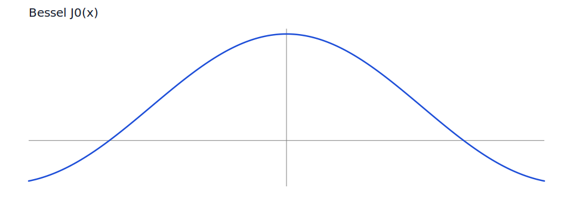
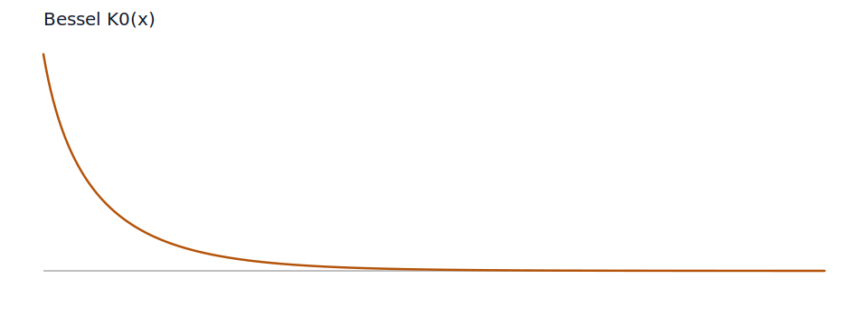
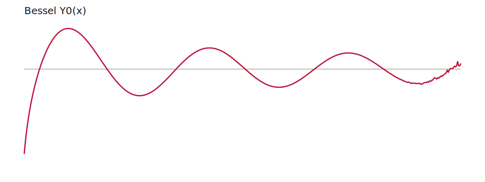

# Bessel and Airy family

## Background

AMOS uses the Bessel and Airy families as the main numerical workhorses for complex special functions. The implementation switches among series, recurrence, asymptotic, and continuation paths depending on region.

The public surface in this family is centered on `zairy`, `zbiry`, `zbesi`, `zbesj`, `zbesk`, `zbesy`, and `zbesh`. The Airy routines evaluate the two Airy branches and their derivatives directly, while the Bessel sequence routines return `\nu, \nu+1, \nu+2, \ldots` values with the same scaling conventions as the original AMOS code.

## Math

```math
Ai(z) = \frac{1}{\pi\sqrt{3}}\sqrt{z}\,K_{1/3}\left(\frac{2}{3}z^{3/2}\right),
\qquad
Ai'(z) = -\frac{1}{\pi\sqrt{3}} z\,K_{2/3}\left(\frac{2}{3}z^{3/2}\right)
```

```math
I_\nu(z) = i^{-\nu} J_\nu(iz),
\qquad
Y_\nu(z) = \frac{J_\nu(z)\cos(\pi\nu) - J_{-\nu}(z)}{\sin(\pi\nu)}
```

```math
H_\nu^{(1)}(z) = J_\nu(z) + iY_\nu(z),
\qquad
H_\nu^{(2)}(z) = J_\nu(z) - iY_\nu(z)
```

```math
Bi(z) = \sqrt{\frac{z}{3}}\left(I_{-1/3}\left(\frac{2}{3}z^{3/2}\right) + I_{1/3}\left(\frac{2}{3}z^{3/2}\right)\right)
```

## Modifications and implementation

The translated implementation keeps the original split between the small-$|z|$ power-series path and the large-$|z|$ Bessel path described in [amos/zairy.f](https://github.com/qchen-fdii-cardc/openspecfun/blob/main/amos/zairy.f). The sequence routines preserve the scaling conventions from AMOS so that underflow-sensitive regions stay numerically stable, and the continuation workers keep the region-by-region logic visible instead of hiding it behind a single generic dispatch.

For Airy, `zairy` uses the `K_{1/3}` and `K_{2/3}` representations on the large-argument side, while `zbiry` uses the matching `I_{\pm 1/3}` and `I_{\pm 2/3}` combinations for the companion function.

For Bessel sequences, `zbesi`, `zbesj`, `zbesk`, and `zbesy` are the base sequence constructors. `zbesh` combines `J_\nu` and `Y_\nu` into the Hankel branches, and the continuation workers feed those routines when the argument has to be moved across a half-plane.

## Examples

```julia
using OpenSpecFun

zairy(1.0, 0.0, 1, 1)
zbiry(1.0, 0.0, 1, 1)
zbesi(1.0, 0.0, 0.0, 1, 1)
zbesj(1.0, 0.0, 0.0, 1, 1)
zbesk(1.0, 0.0, 0.0, 1, 1)
zbesy(1.0, 0.0, 0.0, 1, 1)
```

## Charts

The charts below are generated by `docs/scripts/plot_reference_charts.jl`.

### Airy `Ai(x)`


### Airy `Ai'(x)`


### Airy `Bi(x)`



### Airy `Bi'(x)`



### Dawson integral


### Bessel `I_0(x)`



### Bessel `J_0(x)`



### Bessel `K_0(x)`



### Bessel `Y_0(x)`

